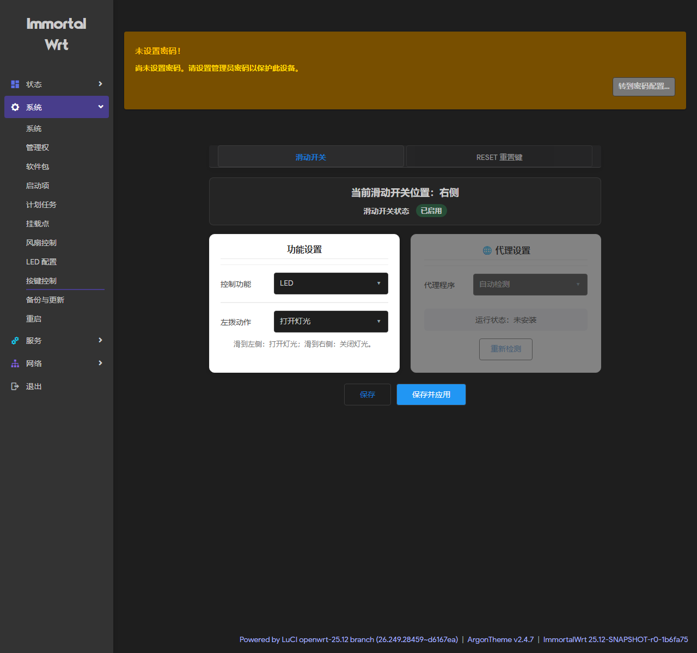
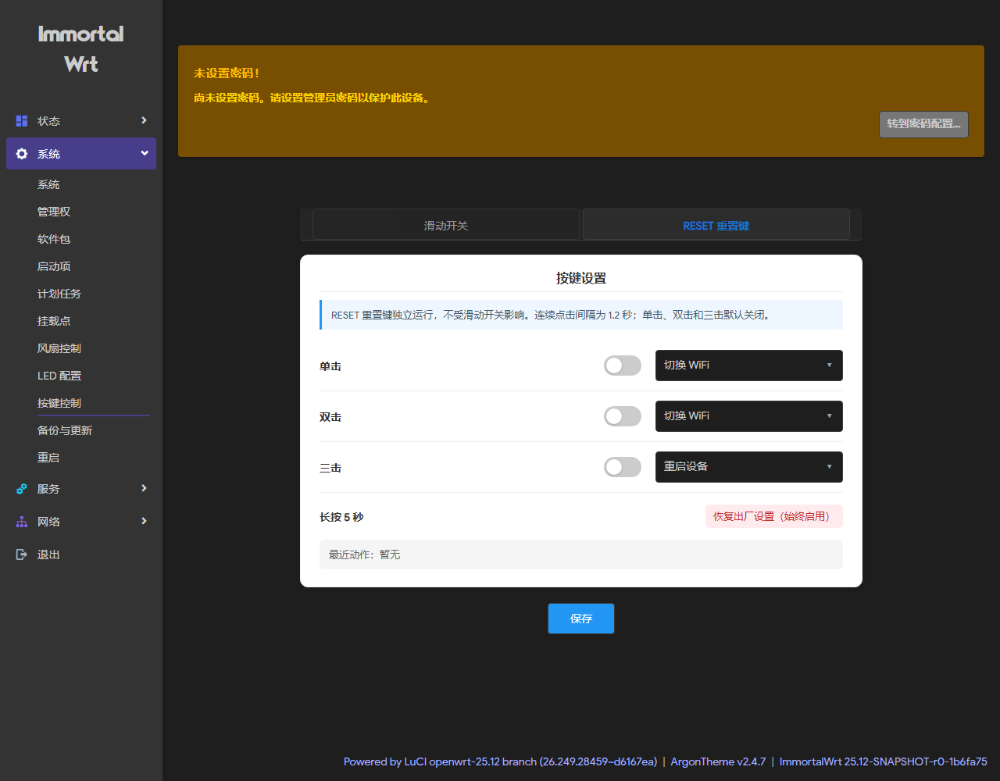

# GL-MT3600BE 滑动开关控制（mt3600be-toggle）

从 [xlucien/oray-x1-pro-toggle-switch](https://github.com/xlucien/oray-x1-pro-toggle-switch)（Oray X1 Pro 版）移植到 **GL.iNet GL-MT3600BE**。

不启动常驻轮询进程：滑动开关由内核 `gpio-keys` + `gpio-button-hotplug` 双边沿中断驱动，
只在真正拨动时拉起一个很短的 shell；开机另做一次状态同步后立即退出。

| 滑动开关 | RESET 重置键 |
| --- | --- |
|  |  |

## 快速安装

SSH 登录路由器后：

```sh
cd /tmp
curl -L https://github.com/xlucien/gl-mt3600be-toggle-switch/archive/refs/heads/main.tar.gz -o pkg.tgz
tar -xzf pkg.tgz
cd gl-mt3600be-toggle-switch-main
sh install.sh
```

卸载方法见文末。

## 硬件事实（本机实测 + 固件取证）

| 项目 | 值 |
| --- | --- |
| 型号 | `glinet,gl-mt3600be`（ImmortalWrt 25.12-SNAPSHOT r0-1b6fa75，mediatek/filogic） |
| DTB 节点 | `/proc/device-tree/gpio-keys/button-mode` |
| label | `mode` |
| gpios | `&pio 3 GPIO_ACTIVE_HIGH` → debugfs `gpio-515` |
| linux,code | `BTN_0`（0x100） |
| linux,input-type | `EV_SW`（0x5） |
| debounce | 10 ms |
| 固件 | `8月17日-istore-os-mediatek-filogic-glinet_gl-mt3600be-squashfs-sysupgrade.bin` |

RESET 键：`/gpio-keys/button-reset` → `gpio-516`，`GPIO_ACTIVE_LOW`。

**不需要改 DTS、不需要重刷固件** —— 原厂固件的运行中 DTB 已经包含这两个节点，
且 `kmod-gpio-button-hotplug` 已加载。

## 与原版（X1 Pro）的关键差异：极性翻转

| 机型 | DTS 极性 | hotplug ACTION | 物理电平 | 沿用 GL-MT3600BE 语义 |
| --- | --- | --- | --- | --- |
| Oray X1 Pro | `GPIO_ACTIVE_LOW` | `pressed` | 低 | Right |
| Oray X1 Pro | `GPIO_ACTIVE_LOW` | `released` | 高 | Left |
| **GL-MT3600BE** | **`GPIO_ACTIVE_HIGH`** | **`pressed`** | **高** | **Left** |
| **GL-MT3600BE** | **`GPIO_ACTIVE_HIGH`** | **`released`** | **低** | **Right** |

所以 `etc/rc.button/BTN_0` 的分发与原版相反：

```sh
pressed)  exec /usr/sbin/mt3600be-toggle-apply high ;;
released) exec /usr/sbin/mt3600be-toggle-apply low  ;;
```

其余逻辑（沿用高电平=左、低电平=右）与原厂 GL-MT3600BE 定制固件一致，无需交换动作。

## 改名对照

| 原版 | 本移植版 |
| --- | --- |
| `/etc/config/x1pro-toggle` | `/etc/config/mt3600be-toggle` |
| `/etc/init.d/x1pro-toggle` | `/etc/init.d/mt3600be-toggle` |
| `/etc/x1pro-toggle.d/` | `/etc/mt3600be-toggle.d/` |
| `/usr/sbin/x1pro-toggle-*` | `/usr/sbin/mt3600be-toggle-*` |
| `/usr/sbin/x1pro-reset-control` | `/usr/sbin/mt3600be-reset-control` |
| `/usr/libexec/x1pro-reset-button` | `/usr/libexec/mt3600be-reset-button` |
| `/usr/libexec/x1pro-delay` | `/usr/libexec/mt3600be-delay` |
| `/etc/rc.button/reset.x1pro-stock` | `/etc/rc.button/reset.mt3600be-stock` |

LuCI 侧沿用 `luci.controller.toggle` / 菜单 `admin/system/toggle` / 视图 `view/toggle/index-v100.js`。

## 依赖与精简

`Makefile` 里声明的是：

```
DEPENDS:=+luci-base +ucode-mod-fs +ucode-mod-uci +ucode-mod-uloop +kmod-gpio-button-hotplug
```

逐项说明（**在这台固件上 5 个全部已存在，安装不会再额外拉包**）：

| 依赖 | 谁在用 | 能否去掉 |
| --- | --- | --- |
| `kmod-gpio-button-hotplug` | 整条事件链（`/etc/modules.d/30-gpio-button-hotplug` 自动加载） | **不能**，去掉就没有中断事件 |
| `luci-base` | LuCI 菜单 + ucode 控制器框架 | 不要网页面板可整组去掉 |
| `ucode-mod-fs` | 控制器读 `/tmp/mt3600be-toggle-state`、popen 代理状态 | 同上，随面板走 |
| `ucode-mod-uci` | 控制器读写 `/etc/config/mt3600be-toggle` | 同上，随面板走 |
| `ucode-mod-uloop` | `mt3600be-delay` 的毫秒定时器（RESET 多击窗口） | 不要 RESET 多击可去掉 |

注意：**不能用 `sleep` 顶替 uloop**。实测这台机器的 busybox `sleep` 不支持小数
（`sleep 0.05` → `invalid number '0.05'`），而 RESET 去抖需要 50 ms / 200 ms 粒度。

三档精简方案：

1. **只保留滑动开关 + 网页面板**：删掉 `etc/rc.button/reset` 接管、`usr/sbin/mt3600be-reset-control`、
   `usr/libexec/mt3600be-reset-button`、`usr/libexec/mt3600be-delay`，以及 JS 里的 RESET 页签；
   `DEPENDS` 去掉 `ucode-mod-uloop`。
2. **不要网页面板（纯脚本）**：只留 `etc/rc.button/BTN_0` + `usr/sbin/mt3600be-toggle-{apply,sync,wifi,proxy}`
   + `etc/config/mt3600be-toggle`，用 uci 直接配；`DEPENDS` 只剩 `+kmod-gpio-button-hotplug`。
3. **已删掉的僵尸配置**：从 X1 Pro 版带过来的 `passwall_*` / `openclash_*` / `ssr_*` 共 9 个 UCI 选项，
   `apply` 从不读、UI 也不渲染，已在本次移植中移除。若真想让左右拨分别控制 PassWall / OpenClash / SSR Plus，
   直接用「代理」模块选对应程序即可，不需要这三个遗留键。

## 灯光策略（当前配置）

GL-MT3600BE 有两颗状态灯，都是 `max_brightness=1` 的二值灯（没有亮度档位）：

| LED | 设备树别名 | 角色 | 本包的处理 |
| --- | --- | --- | --- |
| `blue:status`（gpio-560，ACTIVE_LOW） | `led-running` | 运行指示 | **由滑块 LED 档控制亮灭** |
| `white:status`（gpio-561，ACTIVE_LOW） | `led-boot` | 开机/升级指示 | **开机后强制熄灭，与滑块无关** |

对应两个配置项：

```
option boot_off_leds 'white:status'   # 每次开机强制熄灭的灯（空格分隔），不受滑块影响
option led_name      'blue:status'    # LED 档控制的灯（空格分隔，可多颗）
```

行为：

- **白灯**：开机过程（preinit/升级）仍会由系统闪一下——那是 `led-boot` 的本职；
  开机结束后 S99 的 `force_boot_off_leds()` 会把它压灭并保持，之后滑块怎么拨都不影响它。
- **蓝灯**：跟随滑块。左拨（高电平）= 亮，右拨（低电平）= 灭（`led_high_action/led_low_action`）。
- **RESET 单击"切换灯光"**：同样只切 `led_name` 里的灯，当前即蓝灯。
- **开机同步**：S99 `mt3600be-toggle-sync` 读一次 debugfs 的实际电平，把蓝灯对齐到滑块当前位置。

开机时序：S95 `done` 先点亮蓝灯（`led-running`）→ S99 强制白灯灭 + 按滑块位置同步蓝灯。
所以蓝灯在开机最后几秒会先亮，随后按滑块位置定格。

想改策略时：

```sh
uci set mt3600be-toggle.main.led_name='blue:status white:status'   # 两颗一起控
uci set mt3600be-toggle.main.boot_off_leds=''                      # 不强制灭白灯
uci commit mt3600be-toggle && /etc/init.d/mt3600be-toggle restart
```

## 安装

把本目录上传到路由器（例如 `/tmp/mt3600be-toggle`）后：

```sh
cd /tmp/mt3600be-toggle
sh install.sh
```

安装脚本会：

- 设置脚本权限 `0755`、UCI 配置 `0600`；
- 备份原厂 `/etc/rc.button/reset` 到 `/etc/rc.button/reset.mt3600be-stock`，换成支持多击的版本；
- 启用 `/etc/init.d/mt3600be-toggle` 并做一次开机状态同步；
- 预检 `/proc/device-tree/gpio-keys/button-mode` 是否存在。

所有功能动作默认关闭，安装不会改变 WiFi / 代理 / 灯光状态。

## 现场确认

```sh
uci set mt3600be-toggle.main.global_enabled='0'
uci commit mt3600be-toggle
logread -f -e mt3600be-toggle
```

拨动一次应看到 `MODE=1 (high)` 与 `MODE=0 (low)`。

直接看物理电平：

```sh
mount -t debugfs debugfs /sys/kernel/debug 2>/dev/null
grep '|mode' /sys/kernel/debug/gpio
```

## 实际验证记录（192.168.1.1 实机）

- 开机同步：`mt3600be-toggle: MODE=0 (low)` → 页面显示「右侧」
- 模拟 `ACTION=pressed`（左/高）→ `MODE=1 (high)` → `white:status` 亮度 1（灯亮）
- 模拟 `ACTION=released`（右/低）→ `MODE=0 (low)` → 亮度 0（灯灭）
- LuCI `系统 → 按键控制` 正常渲染，`/admin/system/toggle/api` 返回完整 JSON

## 卸载

```sh
cp /etc/rc.button/reset.mt3600be-stock /etc/rc.button/reset
/etc/init.d/mt3600be-toggle disable
rm -f /usr/sbin/mt3600be-* /usr/libexec/mt3600be-* /etc/init.d/mt3600be-toggle \
      /etc/rc.button/BTN_0 /etc/config/mt3600be-toggle
rm -rf /etc/mt3600be-toggle.d
rm -f /usr/share/ucode/luci/controller/toggle.uc /usr/share/luci/menu.d/toggle-switch.json
rm -rf /www/luci-static/resources/view/toggle
rm -f /tmp/luci-indexcache
```

## License

MIT（沿用上游，见 [LICENSE](LICENSE)）

## 目录结构

```
etc/config/mt3600be-toggle          UCI 配置
etc/init.d/mt3600be-toggle          开机同步 + 强制熄灭 boot_off_leds
etc/rc.button/BTN_0                 滑块事件入口（极性适配在此）
etc/rc.button/reset 由 install.sh 替换为多击处理（原厂备份 .mt3600be-stock）
etc/mt3600be-toggle.d/{high,low}.example  自定义动作 hook
etc/uci-defaults/99-toggle-switch   编入固件时首启接管 RESET
usr/sbin/mt3600be-toggle-{apply,sync,wifi,proxy}
usr/sbin/mt3600be-reset-control
usr/libexec/mt3600be-{reset-button,delay}
usr/share/ucode/luci/controller/toggle.uc
usr/share/luci/menu.d/toggle-switch.json
www/luci-static/resources/view/toggle/{index.js,index.css}
Makefile                            编入固件用（DEPENDS 见上文）
install.sh                          实机安装脚本
docs/                               LuCI 页面截图
```
